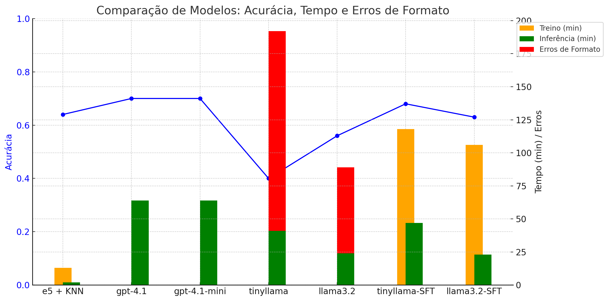

# Comparando LLMs abertos e proprietários para classificação de sentimentos

#### Aluno: [Elvis Alves de Souza](https://github.com/alvelvis)
#### Orientador: [Leonardo Alfredo Mendoza](https://github.com/link_do_github).

---

Trabalho apresentado ao curso [BI MASTER](https://ica.puc-rio.ai/bi-master) como pré-requisito para conclusão de curso e obtenção de crédito na disciplina "Projetos de Sistemas Inteligentes de Apoio à Decisão".

- [Link para o código](comparando-llms.ipynb).

---

### Resumo

Este trabalho avalia o desempenho de diferentes abordagens para análise de sentimentos, comparando modelos de linguagem de grande porte e proprietários (GPT-4.1 e GPT-4.1-mini) com modelos menores e abertos (TinyLLaMA e LLaMA 3.2), com e sem *fine-tuning*. Também é considerada uma abordagem clássica baseada em *embeddings* e classificação por KNN. Os resultados mostram que modelos pequenos e *open-source*, quando ajustados com técnicas eficientes como o *Parameter-Efficient Fine-Tuning* (PEFT) com LoRA, podem alcançar desempenho comparável ao dos modelos proprietários, com menor custo computacional e tempo de inferência. O modelo TinyLLaMA com *fine-tuning*, por exemplo, obteve acurácia de 0.68, próxima à dos modelos GPT (0.70), superando significativamente sua versão sem ajuste fino (0.40). Além disso, o KNN com bons *embeddings* obteve desempenho competitivo (0.64), reforçando o valor de soluções simples e interpretáveis. Os resultados indicam que modelos menores e bem ajustados são alternativas viáveis para aplicações reais de PLN, especialmente em cenários com restrições de recursos.

### Abstract

This study evaluates the performance of different approaches to sentiment analysis by comparing large proprietary language models (GPT-4.1 and GPT-4.1-mini) with smaller open-source models (TinyLLaMA and LLaMA 3.2), both with and without fine-tuning. A classical approach based on embeddings and KNN classification is also considered. The results show that small open-source models, when fine-tuned using efficient techniques such as Parameter-Efficient Fine-Tuning (PEFT) with LoRA, can achieve performance comparable to proprietary models while requiring less computational cost and inference time. For example, the fine-tuned TinyLLaMA model reached an accuracy of 0.68, close to that of the GPT models (0.70), and significantly outperformed its non-fine-tuned version (0.40). Additionally, the KNN approach using high-quality embeddings achieved competitive results (0.64), highlighting the value of simple and interpretable solutions. Overall, the findings suggest that smaller, well-tuned models are viable alternatives for real-world NLP applications, particularly in resource-constrained scenarios.

### 1. Introdução

Grandes modelos de linguagem (*Large Language Models*, LLMs), como o GPT (*Generative Pretrained Transformer*) da OpenAI, têm demonstrado desempenho notável em uma ampla gama de tarefas de Processamento de Linguagem Natural (PLN), sendo amplamente utilizados por pesquisadores, empresas e desenvolvedores. No entanto, seu uso em escala apresenta limitações importantes: além do custo elevado de acesso e operação, esses modelos requerem infraestrutura computacional avançada para execução, o que os torna inviáveis para muitas aplicações específicas, especialmente em ambientes com recursos limitados.

Nesse contexto, ganha relevância a adoção de modelos menores e de código aberto, que podem ser executados localmente e adaptados a tarefas específicas por meio de técnicas de *fine-tuning*. Embora esses modelos não alcancem, em termos absolutos, o mesmo desempenho dos LLMs proprietários de última geração, seu custo reduzido e maior flexibilidade os tornam candidatos promissores para aplicações focadas.

Neste trabalho, avalia-se o desempenho de diferentes modelos, tanto proprietários quanto *open-source*, na tarefa de análise de sentimentos. Os modelos considerados incluem o GPT-4.1 e o GPT-4.1-mini (OpenAI), além dos modelos open-source TinyLLaMA e LLaMA 3.2 disponíveis no Hugging Face. O conjunto de dados utilizado também é proveniente do Hugging Face, garantindo reprodutibilidade e acesso público. Como *baseline*, foi adotado um modelo tradicional baseado em *embeddings* e classificação por k-vizinhos mais próximos (KNN), sem o uso de LLMs.

O objetivo principal deste trabalho é investigar até que ponto modelos menores e abertos, quando devidamente ajustados com fine-tuning, podem competir com modelos proprietários de maior porte em uma tarefa específica de PLN.

### 2. Modelagem

O conjunto de dados utilizado neste trabalho é composto por aproximadamente 31.200 textos para treinamento e 5.210 frases para teste, todos em inglês. Cada exemplo está anotado com uma das três categorias de sentimento: positivo, negativo ou neutro.

Como *baseline*, será utilizada uma abordagem clássica baseada em representações vetoriais e classificação por vizinhança. Inicialmente, os textos são convertidos em *embeddings* de 1024 dimensões utilizando o modelo pré-treinado `intfloat/multilingual-e5-large`, disponível na plataforma Hugging Face. Esse modelo, do tipo *text embedding*, é capaz de gerar representações semânticas densas a partir de textos curtos em múltiplos idiomas, incluindo o inglês. A vetorização considera tanto o conteúdo semântico quanto o contexto das palavras na frase.

Uma vez obtidos os *embeddings*, será aplicado o algoritmo *k-Nearest Neighbors* (KNN) para classificação. O KNN opera agrupando os vetores em torno de seus vizinhos mais próximos no espaço vetorial, atribuindo a cada amostra de teste a classe predominante entre seus *k* vizinhos mais próximos, com base na distância euclidiana. Assim, os dados são ajustados a três regiões no espaço: sentimentos positivos, negativos e neutros.

Para fins de comparação com esse *baseline*, serão utilizados dois modelos de linguagem proprietários da OpenAI: GPT-4.1 e GPT-4.1-mini, ambos acessados via API mediante chave de acesso (paga), com integração realizada por meio da biblioteca LangChain. Esses modelos foram projetados para tarefas gerais de linguagem e utilizados aqui como classificadores por *prompting*, isto é, fornecendo exemplos ou instruções diretas de categorização de sentimentos. Mais especificamente, será utilizada a técnica de *one-shot prompting*, quando se dá um exemplo para o modelo de como a tarefa deve ser executada antes de solicitar que ele de fato comece a realizá-la.

Além disso, serão avaliados dois modelos *open-source* disponibilizados na plataforma Hugging Face: o TinyLLaMA (com 1.1 bilhão de parâmetros) e o LLaMA 3.2 (com 1.23 bilhão de parâmetros). Ambos foram ajustados para interação via *chat*, o que os torna aptos a realizar tarefas instrucionais, como classificação textual, por meio de *prompts* bem formulados. Os *prompts* utilizados são os mesmos para os modelos proprietários e os *open-source*.

Ambos os modelos foram submetidos também a um processo adicional de ajuste fino (*fine-tuning*) específico para a tarefa de análise de sentimentos, utilizando os dados de treinamento do *dataset* de modo supervisionado. Este processo será realizado com a técnica PEFT (*Parameter-Efficient Fine-Tuning*), utilizando o método LoRA (*Low-Rank Adaptation*), que permite a adaptação eficiente de modelos grandes ao inserir matrizes de baixo-*rank* nas camadas do modelo original. O uso de PEFT com LoRA reduz significativamente a necessidade de atualização de todos os parâmetros do modelo, tornando o treinamento mais leve e acessível mesmo com recursos computacionais limitados.

Com isso, serão comparados quatro modelos *open-source*: o TinyLLaMA original, o LLaMA 3.2 original, e o TinyLLaMA e LLaMA 3.2 ajustados via *fine-tuning*. A comparação entre esses modelos e os LLMs proprietários permitirá avaliar o quanto modelos menores e ajustados podem se aproximar do desempenho de modelos de grande porte em tarefas específicas, como a análise de sentimentos.

### 3. Resultados

| Modelo           | Acurácia | Tempo de Treino | Tempo de Inferência | Erros de Formato |
|------------------|----------|------------------|----------------------|------------------|
| e5 + KNN         | 0.64     | 13 min           | 2 min                | 0                |
| gpt-4.1          | 0.70     | 0 min            | ~1h 4min             | 0                |
| gpt-4.1-mini     | 0.70     | 0 min            | ~1h 4min             | 0                |
| tinyllama        | 0.40     | 0 min            | 41 min               | 151              |
| llama3.2         | 0.56     | 0 min            | 24 min               | 65               |
| tinyllama-SFT    | 0.68     | 1h 58min         | 47 min               | 0                |
| llama3.2-SFT     | 0.63     | 1h 46min         | 23 min               | 0                |

Em termos de acurácia, os modelos GPT-4.1 e GPT-4.1-mini apresentaram os melhores resultados (0.70), seguidos de perto pelo modelo tinyllama-SFT (0.68). Este desempenho competitivo por parte do modelo *open-source*, mesmo frente a modelos proprietários de grande porte, é um indicativo promissor do potencial de modelos menores quando submetidos a processos adequados de ajuste fino (SFT).

Um aspecto notável é que modelos como o tinyllama-SFT e o llama3.2-SFT alcançaram acurácias próximas às dos modelos GPT, mas com tempos de inferência consideravelmente menores. Por exemplo, enquanto os modelos GPT-4.1 demandaram aproximadamente 64 minutos para inferência, o tinyllama-SFT obteve desempenho semelhante em apenas 47 minutos. Os experimentos foram realizados utilizando uma GPU NVIDIA GeForce RTX 3070, com 8GB de RAM.

Observou-se também que os modelos pequenos e *open-source*, quando utilizados sem ajuste fino (SFT), apresentaram elevado número de erros de formato — o tinyllama e o llama3.2, por exemplo, produziram respectivamente 151 e 65 erros. Contudo, esses problemas foram completamente eliminados após o *fine-tuning* supervisionado, o que reforça o papel essencial do SFT na robustez e confiabilidade da geração.

Além disso, a diferença de desempenho entre os modelos pequenos com e sem SFT foi significativa. O tinyllama, sem ajuste fino, alcançou apenas 0.40 de acurácia, enquanto sua versão com SFT atingiu 0.68. Essa melhoria coloca os modelos ajustados em um patamar competitivo com soluções proprietárias, demonstrando que modelos compactos, quando bem treinados, podem ser viáveis para aplicações reais.

Por fim, é importante destacar que mesmo uma abordagem clássica de aprendizado de máquina, como o KNN, foi capaz de apresentar desempenho competitivo (0.64) quando combinada com representações vetoriais de alta qualidade (e5 *embeddings*). Esse resultado reforça a relevância de métodos simples e interpretáveis, especialmente quando há acesso a bons recursos de representação textual, podendo atuar como base forte para tarefas específicas ou cenários com restrições computacionais severas.

### 4. Conclusões

Este trabalho investigou o desempenho de diferentes abordagens para análise de sentimentos, com ênfase na comparação entre modelos proprietários de grande porte, como o GPT-4.1, e modelos menores e abertos, como o TinyLLaMA e o LLaMA 3.2, incluindo versões com e sem *fine-tuning*. A análise foi complementada por uma abordagem *baseline* clássica, baseada em *embeddings* e classificação por KNN.

Os resultados demonstram que, embora os modelos GPT-4.1 e GPT-4.1-mini tenham obtido as maiores acurácias (0.70), o modelo *open-source* tinyllama-SFT apresentou desempenho muito próximo (0.68), com tempos de inferência menores e sem apresentar erros de formato. Isso indica que modelos compactos, quando ajustados com técnicas eficientes como o PEFT-LoRA, podem oferecer soluções viáveis e de baixo custo computacional para tarefas específicas de PLN.

Adicionalmente, verificou-se que os modelos pequenos, quando utilizados sem *fine-tuning*, não apenas apresentaram desempenho inferior, mas também produziram um número significativo de erros de formato. O ajuste supervisionado foi capaz de eliminar esses problemas, além de melhorar substancialmente a acurácia — por exemplo, o TinyLLaMA passou de 0.40 para 0.68 com SFT, uma diferença de 28 pontos percentuais.

Outro achado relevante foi o desempenho do modelo clássico baseado em KNN, que, mesmo sem o uso de LLMs, obteve acurácia de 0.64 ao empregar representações vetoriais de alta qualidade. Isso reforça que, em certos contextos, métodos tradicionais ainda têm papel relevante e podem oferecer uma alternativa interpretável e eficiente, especialmente em cenários com restrições computacionais ou operacionais.

Em síntese, os experimentos aqui relatados evidenciam o potencial dos modelos abertos e compactos para tarefas específicas de PLN, desde que combinados com técnicas adequadas de adaptação. Essa constatação reforça a viabilidade de soluções acessíveis e eficientes, que não dependem exclusivamente de modelos proprietários de grande porte, e aponta para um caminho promissor de democratização das tecnologias baseadas em LLMs.

---

Matrícula: 231101070

Pontifícia Universidade Católica do Rio de Janeiro

Curso de Pós Graduação *Business Intelligence Master*